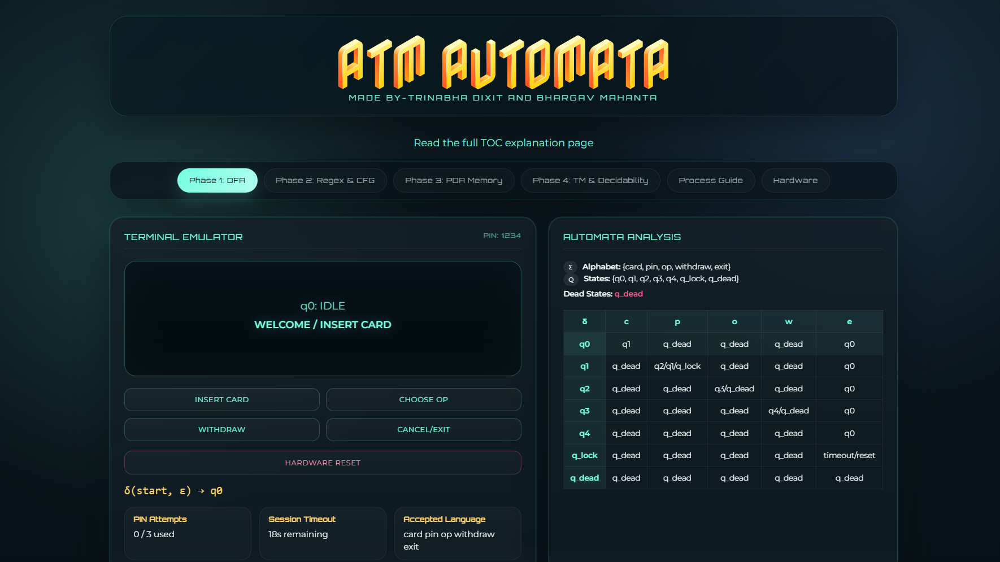
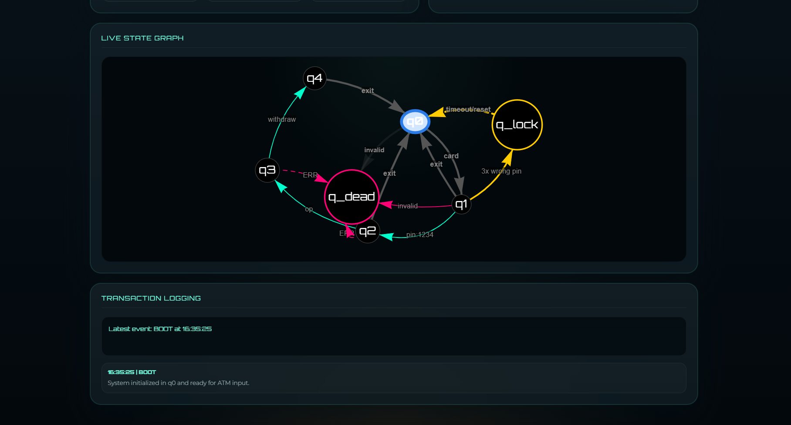
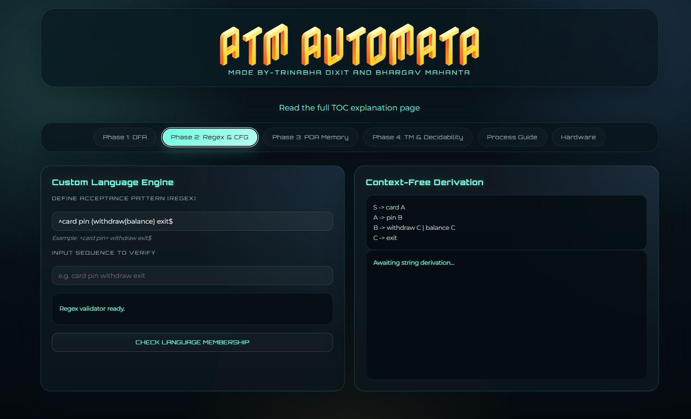
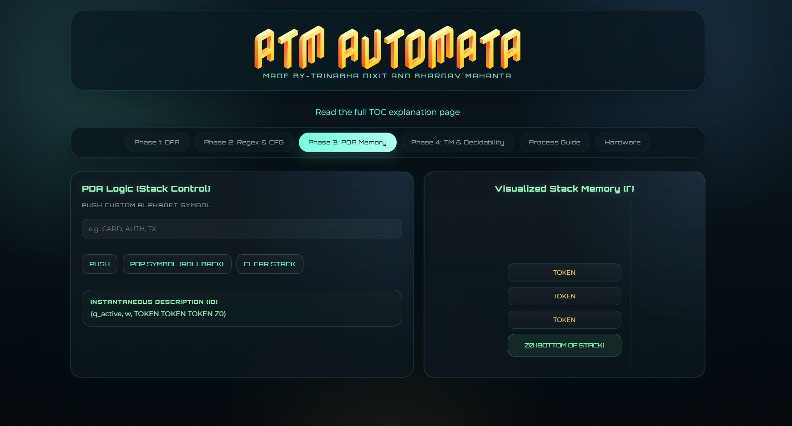
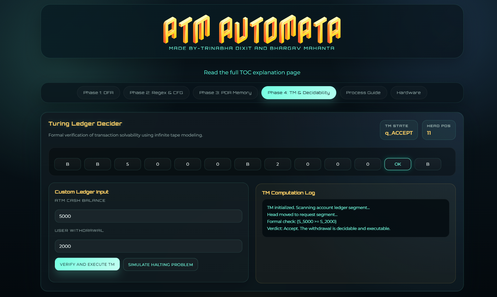

# Formal Modeling, Verification and Extended Implementation of a Secure ATM Transaction System using Automata Theory

## 1. Title

**ATM Automata: Simulation of ATM Transactions using Theory of Computation Concepts**

A Theory of Computation project that models ATM transaction flow using DFA, NFA, ε-NFA, Regular Expressions, CFG, PDA, and Turing Machines.

---

## 2. Team Members

- Trinabha Dixit
- Bhargav Mahanta

---

## 3. Aim

The aim of this project is to model and simulate an ATM transaction system using concepts from Theory of Computation (TOC) such as DFA, NFA, ε-NFA, Regular Expressions, Context-Free Grammar (CFG), Pushdown Automata (PDA), and Turing Machines.

The project demonstrates how real-world systems like ATMs can be represented as formal computational models, helping to understand both practical system design and theoretical concepts.

---

## 4. Modules

This project contains the following files:

- `ATM.html` — Main interactive ATM simulator with DFA-based state transitions, security logic, visualization, and multi-phase TOC exploration.
- `toc-explanation.html` — Theory of Computation explanation page covering DFA, NFA, ε-NFA, regex, CFG, PDA, and TM concepts.
- `README.md` — Project documentation and submission guide.
- `.gitignore` — Git ignore configuration.

The project is organized by TOC concepts:

🔹 **Module 1: DFA-Based ATM Simulator**
- Models ATM workflow using Deterministic Finite Automaton.
- States: `q0` (Idle), `q1` (Auth), `q2` (Menu), `q3` (Processing), `q4` (Cash), `q_lock`, `q_dead`.
- Handles: Card insertion, PIN validation, operation selection, withdrawal, and exit.

🔹 **Module 2: NFA & ε-NFA Extension**
- Introduces multiple possible transitions for the same input.
- Example: PIN input → success / retry / lock / failure.
- ε-transitions represent automatic internal state movement.

🔹 **Module 3: Regular Expression & CFG**
- Defines ATM language as:

  `(card)(pin)(op)(withdraw)(exit)`

- CFG Representation:

  `S -> card A`
  `A -> pin B`
  `B -> op C`
  `C -> withdraw D`
  `D -> exit`

- Includes regex validation tools in UI.

🔹 **Module 4: Pushdown Automata (PDA)**
- Uses stack to simulate memory.
- Operations: push (card, pin, etc.), pop (exit/reset).
- Shows instantaneous description (ID) for stack behavior.

🔹 **Module 5: Turing Machine Simulation**
- Simulates ATM logic using tape and head movement.
- Verifies: balance vs withdrawal, accept/reject decisions.
- Demonstrates decidability concepts.

🔹 **Module 6: Security & System Enhancements**
- Lock state after 3 wrong PIN attempts.
- Timeout auto-reset.
- Transaction logging system.
- Dead state for invalid inputs.

### Related TOC Topics Used

- Deterministic Finite Automaton (DFA)
- Non-Deterministic Finite Automaton (NFA)
- Epsilon-NFA
- NFA to DFA conversion
- DFA minimization
- Regular Expressions
- Context-Free Grammar (CFG)
- Pushdown Automaton (PDA)
- Turing Machine (TM)
- Language acceptance and rejection
- Trap/lock state modeling
- Timeout and recovery behavior

---

## 5. Highlights / Features

✅ Interactive ATM simulation UI

✅ Real-time DFA state transitions

✅ Live graph visualization of automata

✅ Regex-based language validation

✅ CFG derivation visualization

✅ Stack-based PDA simulation

✅ Turing Machine tape execution

✅ Security features (lock, timeout)

✅ Transaction logging with timestamps

✅ Covers complete TOC pipeline (DFA → TM)

---

## 6. Screenshots

Capture these screens from your running project UI and add them later:

- ATM Interface (Main Screen)
- State Transition Graph
- Regex Validation Module
- PDA Stack Visualization
- Turing Machine Tape

If screenshot images are added, include them like this:

```markdown





```

---

## 7. Advantages / Benefits

✔ Bridges theory with real-world ATM systems.

✔ Helps visualize abstract TOC concepts.

✔ Interactive learning improves understanding.

✔ Covers entire syllabus in one project.

✔ Useful for viva and demonstrations.

✔ Shows practical applications of automata.

---

## 8. Drawbacks & Future Improvements

### Drawbacks

❌ Simplified ATM logic (no real banking backend).

❌ Limited operations (only withdrawal modeled).

❌ No database or authentication system.

❌ UI is simulation-only (not production-level security).

### Future Improvements

🚀 Add backend support (Node.js + MongoDB).

🚀 Include more operations (balance check, deposit, transfer).

🚀 Add multi-user authentication.

🚀 Convert to a mobile-friendly web app.

🚀 Integrate hardware prototype (Arduino ATM).

🚀 Add AI-based fraud detection features.

---

## 9. Societal Measures and Usage

This project helps students understand secure transaction systems and the importance of safe computation.

It demonstrates the importance of:

- Authentication
- Error handling
- Security protocols
- Formal system design

### Usage Scenarios

- Educational institutions
- TOC learning platforms
- Demonstrations for digital banking systems
- Classroom and viva presentations

### Societal Impact

- Promotes awareness about ATM security.
- Teaches safe transaction practices.
- Reinforces the importance of formal system behavior.
- Encourages responsible design of secure digital systems.

---

## Formal Modeling, Verification and Extended Implementation Explanation

🔹 **1. Formal Modeling**

“We modeled the ATM system using formal models like DFA, NFA, CFG, PDA, and Turing Machine.”

- DFA → main transaction flow.
- NFA → multiple possibilities in PIN logic.
- CFG → grammar representation.

🔹 **2. Verification**

“We verify whether a transaction sequence is valid or not using automata concepts.”

- Regex validation ✔
- DFA acceptance/rejection ✔
- TM checking (balance vs withdrawal) ✔

Example:

`card pin op withdraw exit` → Accepted

Wrong order → Rejected

🔹 **3. Extended Implementation**

“Beyond basic DFA, we extended the system with advanced TOC concepts and real-world features.”

- PDA → stack memory
- TM → computation model
- Logging system
- Timeout + lock state

🔹 **4. Secure ATM Transaction System**

“We added security features similar to real ATMs.”

- 3 wrong PIN → `q_lock`
- Invalid sequence → `q_dead`
- Timeout → auto reset
- Controlled transitions

🔹 **5. Using Automata Theory**

“All system behavior is based on Theory of Computation concepts.”

- States, transitions, language
- Acceptance conditions
- Formal verification

This project uses TOC as the foundation for the ATM system, not just as a supporting topic.

---

## How to Run

1. Open `ATM.html` in a web browser.
2. Use the buttons to simulate ATM actions:
   - `Insert Card`
   - `Enter PIN`
   - `Choose Op`
   - `Withdraw`
   - `Cancel/Exit`
3. Open `toc-explanation.html` to review the Theory of Computation explanation.

---

## Project Files

- `ATM.html` — Main ATM simulator and state visualization.
- `toc-explanation.html` — TOC explanation and formal theory page.
- `README.md` — Project documentation and submission guide.
- `.gitignore` — Git ignore configuration.
